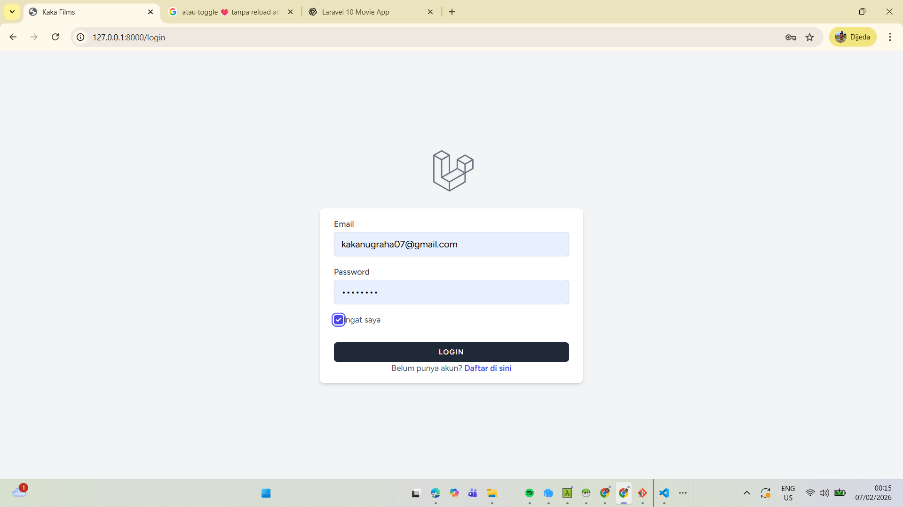
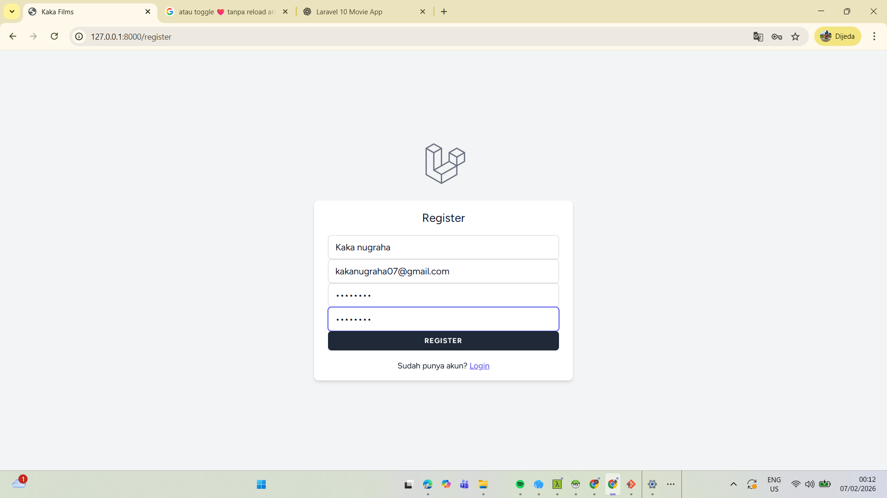
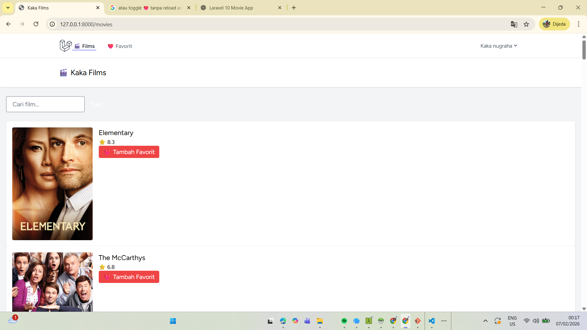
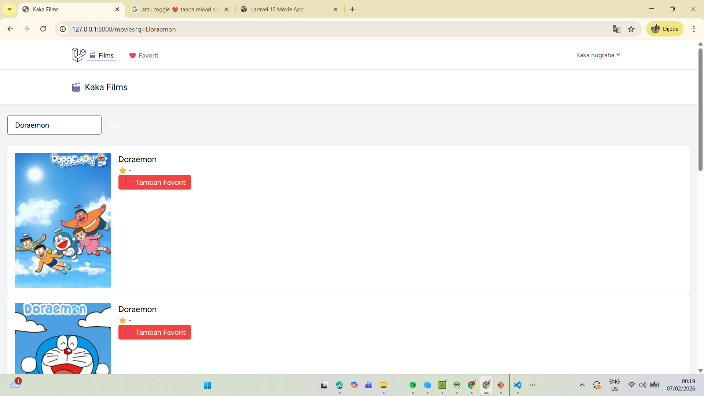
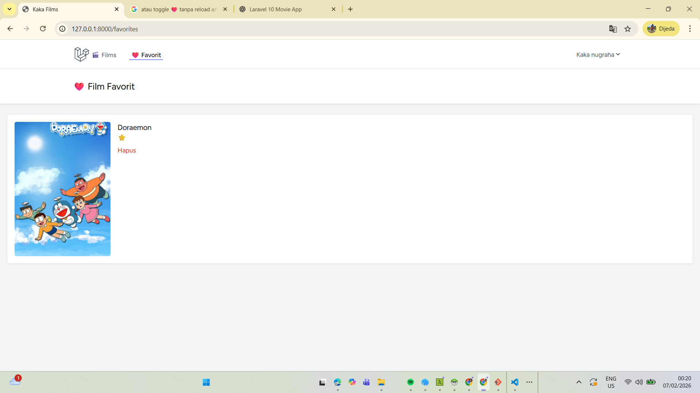
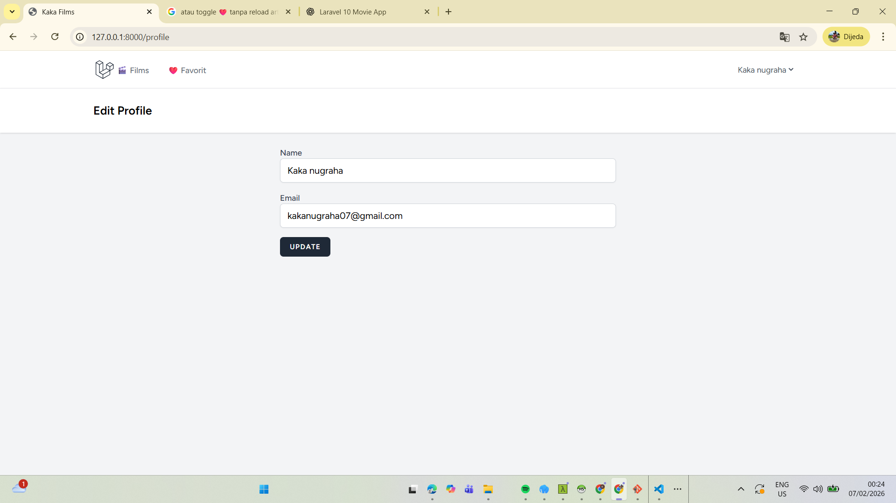

# Kaka Films 🎬

Kaka Films adalah aplikasi web berbasis Laravel yang menampilkan daftar film/TV Show dari API publik **TVMaze**.  
Aplikasi ini menyediakan fitur autentikasi pengguna, pencarian film, dan manajemen daftar favorit.

Aplikasi ini dibuat untuk memenuhi tugas mata kuliah  
**Pemrograman Berbasis Web**.

---

## 👤 Identitas Mahasiswa
- **Nama** : (Kaka Nugraha)
- **NIM**  : (2307024)
- **Program Studi** : (S1 Sistem Informasi)
- **Mata Kuliah** : Pemrograman Berbasis Web

---

## 🛠️ Teknologi yang Digunakan
- PHP 8.1+
- Laravel 10
- Blade Template Engine
- Tailwind CSS
- Laravel Breeze (Authentication)
- MySQL / MariaDB
- Alpine.js
- API TVMaze

---

## ✨ Fitur Aplikasi
- Register & Login
- Menampilkan daftar film (List View)
- Pencarian film
- Menambahkan film ke favorit
- Melihat & menghapus favorit
- Manajemen profil pengguna
- Logout

---

## 🧭 Alur Penggunaan Aplikasi
1. User membuka aplikasi
2. User melakukan **Register**
3. User **Login**
4. Sistem menampilkan halaman **Kaka Films**
5. User dapat:
   - Mencari film
   - Menambahkan film ke favorit
6. User membuka menu **Favorites**
7. User **Logout**

---

## 🖼️ Screenshot Aplikasi (Langkah demi Langkah)

### 1️⃣ Halaman Login
Menampilkan form login untuk pengguna yang telah terdaftar  

---

### 2️⃣ Halaman Register
Digunakan untuk membuat akun baru  

---

### 3️⃣ Halaman Dashboard / Kaka Films
Menampilkan daftar film dari API TVMaze  

---

### 4️⃣ Fitur Pencarian Film
Pengguna mencari film berdasarkan judul  

---

### 5️⃣ Menambahkan Film ke Favorit
Klik tombol ❤️ untuk menyimpan film  

---

### 6️⃣ Halaman Favorit
Menampilkan daftar film favorit pengguna  

--
